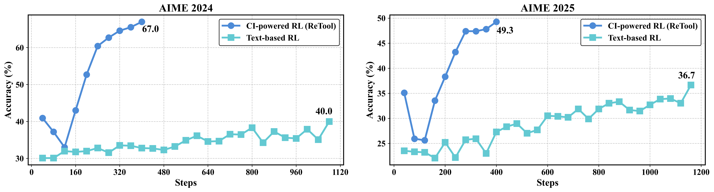

<div align='center'>
<h1>ReTool: Reinforcement Learning for Strategic Tool Use in LLMs</h1> 
<h2>ByteDance Seed</h2>

  

[](https://arxiv.org/pdf/2504.11536)
[](https://retool-rl.github.io/)
[](https://huggingface.co/datasets/JoeYing/ReTool-SFT)
[](https://huggingface.co/JoeYing/ReTool-Qwen-32B)
</div>


**🔥 News!!!**

- [2025/04] We release the model checkpoints and inference code. <span style="color: red;">[**New!**]</span>


In this work, we embrace the RL paradigm and introduce **ReTool**, a **Tool**-augmented **Re**inforcement learning framework explicitly designed to guide LLMs towards optimal strategies for leveraging external computational tools during reasoning. Our comprehensive experiments on AIME2024 and AIME2025 demonstrate that ReTool not only achieves superior accuracy compared to conventional text-based RL approaches, but also converges with significantly fewer training steps.

🚀 **ReTool** achieves accuracy of 67.0% on AIME 2024 and 49.3% on AIME 2025 based on the Qwen2.5-32B-Instruct model, outperforming the text-based RL baseline with less than 50% training steps.



## Model Use

We provide the model weights of [ReTool-Qwen-32B](https://huggingface.co/JoeYing/ReTool-Qwen-32B) and [ReTool-DeepSeek-R1-Distill-Qwen-32B](https://huggingface.co/JoeYing/ReTool-DeepSeek-R1-Distill-Qwen-32B), which are trained based on Qwen2.5-32B-Instruct and DeepSeek-R1-Distill-Qwen-32B.

### Environment Setup

```bash
pip install vllm==0.7.3
pip install packaging
pip install ninja
pip install flash-attn --no-build-isolation
pip install deepspeed
pip install accelerate
pip install datasets
pip install "git+https://github.com/tongyx361/symeval.git"
pip install timeout_decorator
```

### Inference

To speed up open-source progress, we are currently using [STILL3](https://github.com/RUCAIBox/Slow_Thinking_with_LLMs)'s inference framework to evaluate our trained checkpoints.

**Quick start for model inference:**

```python
cd evaluation
bash scripts/eval.sh
```

### Datasets
We provide training and validation datasets for ReTool.

- Cold-Start: [ReTool-SFT](https://huggingface.co/datasets/JoeYing/ReTool-SFT).
- RL Training: [DAPO-Math-17k](https://huggingface.co/datasets/BytedTsinghua-SIA/DAPO-Math-17k) by [DAPO](https://arxiv.org/pdf/2503.14476), thanks for their great work!
- RL Validation: AIME 2024, AIME 2025 (can be found in `evaluation/dataset`)

## Acknowledgement

We thank the [verl](https://github.com/volcengine/verl) for providing the awesome open-source RL infrastructure.

## Citation

If you find our project helpful, please cite:

<pre style="background-color: auto; padding: 0.8rem 1rem 0.4rem 1rem; border-radius: 8px; overflow-x: auto; font-size: 0.9rem;">
@misc{feng2025retoolreinforcementlearningstrategic,
title={ReTool: Reinforcement Learning for Strategic Tool Use in LLMs}, 
author={Jiazhan Feng and Shijue Huang and Xingwei Qu and Ge Zhang and Yujia Qin and Baoquan Zhong and Chengquan Jiang and Jinxin Chi and Wanjun Zhong},
year={2025},
eprint={2504.11536},
archivePrefix={arXiv},
primaryClass={cs.CL},
url={https://arxiv.org/abs/2504.11536}, 
}
</pre>
